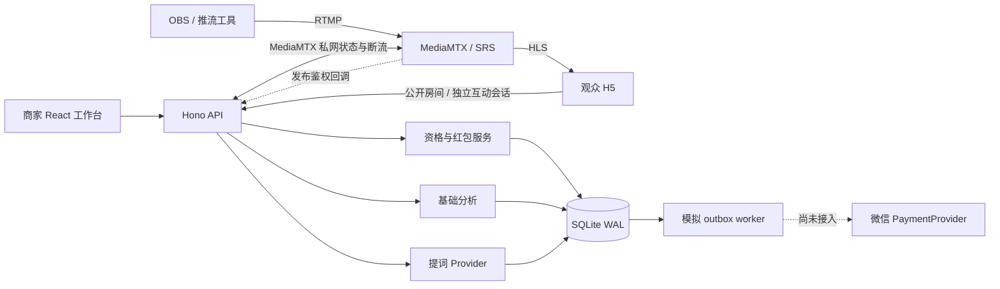

# 架构与实现边界

对应 0.2.0。公开仓库包含应用、部署模板和回归测试；具体服务器状态以[服务器测试记录](server-testing.md)为准。

## 单仓库与服务边界

默认一个 Node 进程和一个 SQLite 文件，视频分片不经过业务 API。`src/web` 为商家与观众界面，`src/shared/types.ts` 为 DTO，`src/server/app.ts` 负责路由与授权，`auth.ts` 负责签名会话，`db.ts` 管理数据库及迁移，`services` 提供观看资格、流媒体、红包、支付和提词边界。

开发时 Vite 在 5173 代理 `/api` 至 8787；构建后应用同源提供网页与 API。逻辑服务保持同一数据库事务边界，尚未实现分布式部署、水平扩容或大规模争抢队列。

## 身份与公开数据边界

商家使用部署者配置的独立凭据换取 12 小时签名 Cookie，包含商家 ID、独立 `sid`、到期时间和 `credentialVersion`。Cookie 使用 HttpOnly、SameSite=Strict，生产增加 Secure，路径取 `APP_BASE_PATH`。

注销把当前 `sid` 写入 `revoked_sessions` 并清 Cookie；撤销记录持久化，应用重启后旧 Cookie 仍被拒绝。同一商家的其他登录有独立 `sid`。移除或变更商家凭据后，旧凭据版本无法通过校验；环境配置在重启应用后生效。签名密钥轮换使所有既有签名会话失效，worker 定期删除已过期撤销记录。

路由从服务端验证的商家会话确定租户，逐项检查房间归属；客户端不能通过提交另一商家 ID 切换租户。推流密钥、商品内部证据和提词建议只在授权接口返回，公开 DTO 不包含这些内容。

观众身份是随机 UUID 的匿名 Cookie，会话可在多个房间使用，不能证明真人、实名或实际收款资格。公开房间和播放器独立于互动身份加载，身份或领取记录请求失败不会阻断公开视频；提问、心跳及领取需要有效互动会话。

写请求要求 JSON，并检查 Origin 与跨站 Fetch Metadata。单实例限流分开商家鉴权和观众建会话，预算分别为每分钟 60 与 600 次；商家鉴权按客户端地址计数，不能通过新观众 Cookie 重置。只有 socket 地址被列入 `TRUSTED_PROXY_IPS` 的代理可通过有效 `X-Real-IP` 提供客户端地址；任意 `X-Forwarded-For` 不被采用。代理必须覆盖客户端传入的身份头。

当前没有注册、短信、微信 OAuth、企业认证或商家内子账号。生产禁止本地演示登录，完整身份与风控体系仍待接入。

## 观看资格、本场与历史统计

`recordPresence` 以服务端毫秒时间累计。只为连续有效心跳之间大于零、最多 20 秒的间隔计时，不早于 `live_started_at`；重复同时间心跳不加时，超时断线不补算。暂停、隐藏、未开放房间或不符合播放要求时不累计，恢复后从新的连续区间开始。

- `REQUIRE_PLAYBACK=false`：开放房间内页面可见即可累计，用于本地业务演示。
- `REQUIRE_PLAYBACK=true`：还要求客户端 `playing=true`，且 MediaMTX 当前信号查询结果为在线。无配置、状态未知或断线均不授予新增时长。

`visits.watch_millis` 保留历史总毫秒数，`session_watch_millis` 保存本场资格毫秒数；对外秒数在返回时向下取整，避免每次心跳丢失小数余量。`watch_seconds` 保留累计整秒，供当前分析查询兼容使用。

房间从非 `live` 进入 `live` 时，本场资格和 active 标记清零；历史观看、presence、问题、活动、领取和账本保留。资格不再跨场继承，分析仍按房间累计，并未实现每场独立的完整统计模型。

当前在线数统计最近 30 秒可见页面心跳；它不等于播放器连接数。近 30 分钟图按每分钟满足当前计时条件的会话去重。平均时长是房间累计访问会话的平均停留，匿名会话数不是去重真人数。客户端 `playing` 也是可伪造输入，这套机制只用于演示资格，不作为真实资金反作弊依据。

活动时间以服务端为准。商家活动列表和公开房间均返回 `serverTime`，前端校准本机偏移后显示倒计时；最终领取窗口仍由 API 服务端检查。

## 红包一致性与数据库迁移

所有金额存整数分。创建活动写 `simulation_budget → campaign_reserved`，不表示真实账户充值。抢领在 `BEGIN IMMEDIATE` 事务内检查活动、时间、直播和观看资格，分配正整数金额，扣池，写领取、账本及 outbox。唯一键 `(campaign_id,viewer_id)` 防止重复扣款，SQLite 写锁串行化争抢。

随机分配为其余红包各保留至少 1 分，最后一份取得余款。重复请求复用已有领取；开启播放要求时，HTTP 入口还会检查当前信号。断线后可通过领取记录接口查看历史结果，不能依赖断线状态下重新调用领取接口取回记录。

worker 每 2 秒处理最多 100 个 pending 项，在同一事务中写账本并更新状态。模拟终态为 `simulated`，不会标记为真实 `paid`。活动到期、手动关闭或结束直播间，将未领取余款记为 `simulation_budget_returned`；已领取款可继续模拟处理。

数据库 schema v2 使用正式事务迁移：新增总毫秒、本场毫秒、active 及撤销表；v1 的累计秒数乘 1000 保留为历史毫秒，本场资格初始化为零。重复打开不会重复迁移。多实例扩展前需要改造数据库、领取原子性、队列消费和迁移策略，不能直接共享当前 SQLite 进行水平扩展。

本版账本为追加的等额转移记录，没有数据库外部篡改防护、全量导出或完整审计后台。真实支付接入约束见[支付说明](payments.md)。

## 流媒体状态与控制

房间 `draft/live/ended` 是商家控制的业务状态，开放房间不会自动启动推流。`StreamAdapter` 区分公开 HLS 路径与私密发布 token，支持 MediaMTX/SRS 地址及发布鉴权回调。

`MediaController` 当前只实现 MediaMTX Control API：私网查询 `live/<roomId>`，读取实际在线状态、来源和引擎 reader 数；状态结果缓存约 2.5 秒，失败返回 `connected:null`，不会假定在线。未配置返回 `configured:false` 与提示，不会伪造断流成功。

结束房间、轮换推流密钥及显式断流接口会尝试踢出 RTMP/RTMPS 连接，再查路径确认没有仍在线的推流来源。请求失败、不支持的协议或复查仍在线返回失败说明。业务状态/密钥已更新不会因此回滚；前端显示实际 `streamAction`，必要时要求手动停止 OBS。

SRS 暂保留推流与播放地址及 `on_publish` 适配，没有 SRS 控制面；采用严格播放资格时必须具备可用的信号实现，否则无法累计和领取。默认本机 Compose 未启用发布鉴权与 Control API，共享服务器应使用独立部署配置，见[流媒体说明](streaming.md)。

## 子路径部署

前端以 `VITE_BASE_PATH=/studio/ npm run build` 生成带前缀资源、API 请求和观看链接；运行时设置 `APP_BASE_PATH=/studio/` 限定 Cookie 路径。Nginx 将外部 `/studio/` 剥离后转发应用，因此内部路由仍是 `/`、`/api`、`/watch/...`。`APP_ORIGIN` 仅配置 HTTPS origin，不包含路径。

HLS 使用独立 `/studio/media/` 转发，Control API 和发布鉴权回调不对公网开放。配置与回滚流程见[服务器测试说明](server-testing.md)。前端前缀改变必须重建；两个环境变量本身不会为后端增加新的路由前缀。

## 提词与验收边界

当前 `GroundedCopilot` 根据已批准事实、当前文本、选中问题与活动提示生成建议、fact IDs、出处、风险和下一环节。输入后约 600 ms 更新，活动提示定期刷新。规则覆盖部分疾病功效、绝对化与激励表述，未命中不表示合规，证据真实性仍由商家审核。

当前不采集麦克风，不调用远程模型或 ASR。后续模型接入应保留事实引用、失败回退及商家可见边界，不让模型决定资金发放或修改活动规则。

26 项回归测试覆盖应用边界；本机 10 项真实媒体检查包含 RTMP、HLS 下载解码、鉴权、资格及断流。它们不等于浏览器、OBS 硬件、移动端、微信内播放、服务器公网或真实支付全部验收，实际进展分开记录在[验收说明](acceptance.md)和[服务器测试说明](server-testing.md)。
