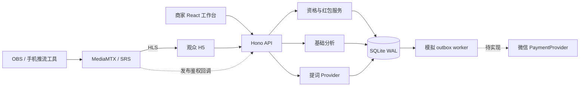

# 架构与实现边界

## 单仓库与服务边界

默认是一套 Node 进程和一个 SQLite 文件，视频数据不经过业务 API。逻辑服务单独放在 `src/server/services`，先保持同一事务边界，未来再按负载拆分。开发时 Vite 在 5173 代理 API 到 8787；构建后 Hono 在 8787 同源提供网页和 API。

目录：`src/web` 为商家与观众界面；`src/shared/types.ts` 为公共 DTO；`src/server/app.ts` 为路由与授权；`db.ts` 为初始 schema；`auth.ts` 为签名 Cookie；`services` 为流媒体、红包、支付与提词适配。

## 身份与数据可见性

- 商家：部署者配置独立访问凭证，交换为 12 小时 HttpOnly/SameSite=Strict 签名 Cookie；生产启用 Secure。路由按签名中的 merchant ID 验证房间归属，前端不能传入另一商家 ID 冒充。
- 观众：服务端签发随机 UUID 的匿名会话，同一 Cookie 可在多个房间使用；清 Cookie 或换浏览器会创建新身份。不是实名账户，不防女巫攻击，不能收真钱。
- 商家事实/推流凭据/提词接口需要商家会话；公开房间 DTO 只返回观看所需信息。React 按文本渲染观众提问与证据，未使用 HTML 注入。
- 写请求要求 JSON，检查 Origin 与跨站 Fetch Metadata；不支持任意跨源 Cookie 请求。生产还应在受信反向代理层限流、防暴力登录并审计。
- 会话签名密钥轮换会使已有会话失效；单个访问凭证变更不会自动撤销已签发 Cookie，最长需等待 12 小时。正式身份服务需加入会话撤销。

当前没有注册、手机短信、微信 OAuth、企业认证或商家内子账号。`DEMO_MODE` 仅用于本机演示。

## 红包一致性

所有金额存为整数分。创建活动时生成一条 `simulation_budget → campaign_reserved` 转移；不是对真实资金账户充值。

抢领在 `BEGIN IMMEDIATE` 中执行：检查活动/时间/直播/观看资格，检查已有领取，随机分配正整数金额，扣池，写 claim、账本、outbox。唯一键 `(campaign_id,viewer_id)` 避免重扣。并发请求由 SQLite 写锁串行化，不宣称十万并发。

剩余 `N` 个、金额 `R` 分时，随机上限不超过 `R-N+1`，为其他红包保留至少 1 分；最后一份取得全部余款。重复领取返回原记录，即使活动随后关闭也不再扣钱。

模拟 worker 每 2 秒消费最多 100 项，账本唯一约束和状态更新置于同一事务，进程重启后可恢复 pending。模拟终态是 `simulated`，不是 `paid`。worker 只在 API 入口进程启动，测试直接调用服务函数。

活动结束、过期或直播间结束时，将未领取余款转到 `simulation_budget_returned`。已领取款仍可完成模拟处理。账本以每一行等额借贷记录转移；业务代码不修改旧账本行。本版没有数据库外部篡改防护或审计签章。

`schema_migrations` 记录初始版本，schema v1 在空数据库上创建。后续变更必须增加正式迁移，不可只改 `CREATE TABLE IF NOT EXISTS` 并假设老库自动升级。多副本部署前应改造 PostgreSQL/Redis/队列与幂等消费策略。

## 提词与事实

`CopilotProvider` 的当前实现为 `GroundedCopilot`：输入当前文本、选中问题、批准事实和活动提示，输出下一句、fact IDs、证据、风险与下一环节。用户输入后 600 ms 更新；问题以实际提问聚合后供主播选择。

规则检测特定疾病功效、绝对化与激励表述；并不穷尽违规语义。没有证据或无匹配事实时要求先核实，不创造价格、疗效或资质。事实由商家手工审核，系统未验证证据文件真伪。接入 LLM 时要把商品、语音和评论都视为不可信数据，强制事实引用，失败退回人工复核，不能让模型决定付款或改活动规则。

当前不采集麦克风。后续 ASR 需明确用户授权、供应商处理范围与存储期限；提词仅在商家界面显示，推流画面应由主播避免屏幕共享泄露。

## 流媒体与统计

房间状态是业务状态。`live_started_at` 用于排除开播前时间；不会自动检测流存在性。发布 token 与公开 HLS 路径分离。引擎回调只限制新连接；默认本机引擎配置尚未开启鉴权，结束/旋转不踢已有连接。

每 5 秒页面可见心跳：只计入相邻间隔不超过 20 秒的服务器时间，且不早于本轮开播时间。隐藏时停止累计，30 秒无心跳从在线数消失。统计按房间保留，重复开播不清空。每分钟去重 presence 用于近 30 分钟图；平均时长为该房间所有访问会话平均累计秒数。

匿名人数不等于真人，页面可见不等于视频播放；不把统计称为真实订单或 GMV。正式生产需要播放 QoE、流状态事件、可靠在线会话、数据保留策略及聚合存储。
