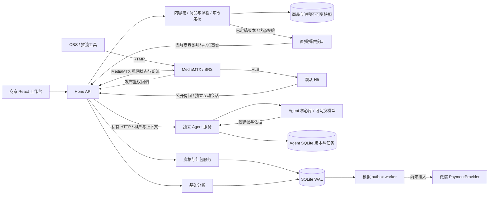

# 架构与实现边界

**开发规范已更新：** 最终模块划分和新增代码约束以 [模块开发规范](module-development.md)、[平台存储规范](storage-architecture.md) 与仓库根 `AGENTS.md` 为准。以下内容描述既有实现和运行边界，不作为继续合并业务模块的依据。

对应 0.5.0。直播底座、流媒体与 Agent 执行独立运行；公开仓库包含应用、部署模板和回归测试。具体服务器与新版本状态以[服务器测试记录](server-testing.md)和[验收说明](acceptance.md)为准。

## 单仓库与服务边界

默认两个 Node 进程和两个 SQLite 文件：直播 API 使用 `studio.sqlite`，独立 Agent 使用 `agent.sqlite`，流媒体另行运行。视频分片不经过业务 API，Agent 不读写直播数据库、推流配置或账本。

当前业务代码已按 [模块迁移记录](module-migration.md) 分配：`src/modules/` 管理所属业务，`src/platform/` 提供公共能力，`src/composition/` 装配业务服务。Agent 实现在 `src/modules/agent/`，`src/shared/agent.ts` 保留消息契约；原 `src/server`、`src/agent` 仅保留部署入口及历史初始化。直播只通过 `AgentBridge` 请求 Agent，不加载其模型实现或数据库。浏览器只访问业务 API，商家身份、房间归属与上下文组装保持在可信服务端。

`npm run dev` 并行启动直播 8787、Agent 8788 和 Vite 5173；`dev:agent`、`start:agent` 可单独启动 Agent。构建后直播进程同源提供网页与 API。各进程按单实例设计，未实现跨副本队列协调、水平扩容或大规模争抢。

## Agent 消息与版本生命周期

直播网关校验商家会话及房间归属，读取当前已审核事实，组成 `AgentContext`：商品、当前话术、选中的问题、事实和活动提示。商家输入不能额外指定模型端点、密钥、租户或替换服务端事实。Agent 仅返回建议、事实标识、出处、风险、阶段摘要和结果状态，不执行直播切换、商品更新、活动发放或支付操作。

每个租户有独立标准风格，也可建立品牌风格。`PromptContent` 保存自定义任务提示、语气、受众及场景样例；每次保存新增不可变版本，数据库触发器阻止版本内容更新和删除。发布只切换已发布版本指针。试演可选未发布版本，直播模式只允许已发布版本；入队时快照固定版本和上下文，后续发布不改变已有任务。

运行结果可记录「有用/需改进」与反馈文字，供后续人工调整提示词。反馈没有自动训练、自动改权重或自动发布功能。结果显示证据准备、生成、引用核对和表达复核等简短摘要，不显示模型内部思维链。

队列持久化在 Agent SQLite，默认全局最多 100 项、每租户 20 项待完成任务，均包含 queued 和 running；并行执行 2 项。超额拒绝入队，已有幂等请求返回同一任务，同幂等键不同内容返回冲突。重启时 queued 继续调度，遗留 running 标为失败，不悄悄重复模型请求；重试要创建新任务。详见[Agent 说明](agent.md)。

Agent 退出或模型不可用不停止直播与演示红包。私有 HTTP 暂不可用时网关返回明确状态；模型调用失败可由 Agent 核心明确回退到 `grounded-rules`，结果 provider 不伪装为远程模型。直播网关还会在读取建议时检查引用是否撤回、直播场次是否变化及建议是否超时，标记过期建议。

## 身份与公开数据边界

商家使用部署者配置的独立凭据换取 12 小时签名 Cookie，包含商家 ID、独立 `sid`、到期时间和 `credentialVersion`。Cookie 使用 HttpOnly、SameSite=Strict，生产增加 Secure，路径取 `APP_BASE_PATH`。

注销把当前 `sid` 写入 `revoked_sessions` 并清 Cookie；撤销记录持久化，应用重启后旧 Cookie 仍被拒绝。同一商家的其他登录有独立 `sid`。移除或变更商家凭据后，旧凭据版本无法通过校验；环境配置在重启应用后生效。签名密钥轮换使所有既有签名会话失效，worker 定期删除已过期撤销记录。

路由从服务端验证的商家会话确定租户，逐项检查房间归属；客户端不能通过提交另一商家 ID 切换租户。推流密钥、商品内部证据和提词建议只在授权接口返回，公开 DTO 不包含这些内容。

观众身份是随机 UUID 的匿名 Cookie，会话可在多个房间使用，不能证明真人、实名或实际收款资格。公开房间和播放器独立于互动身份加载，身份或领取记录请求失败不会阻断公开视频；提问、心跳及领取需要有效互动会话。

写请求要求 JSON，并检查 Origin 与跨站 Fetch Metadata。单实例限流分开商家鉴权和观众建会话，预算分别为每分钟 60 与 600 次；商家鉴权按客户端地址计数，不能通过新观众 Cookie 重置。只有 socket 地址被列入 `TRUSTED_PROXY_IPS` 的代理可通过有效 `X-Real-IP` 提供客户端地址；任意 `X-Forwarded-For` 不被采用。代理必须覆盖客户端传入的身份头。

当前没有注册、短信、微信 OAuth、企业认证或商家内子账号。生产禁止本地演示登录，完整身份与风控体系仍待接入。

Agent 的 `/v1/*` 需要服务 Bearer token 和可信 `x-studio-tenant`。这些由直播桥接层生成，不接受观众传入。Agent 端口和健康接口仅用于本机/私网，不反代公网。输入快照会在 Agent 库中留存；上下文摘要 hash 不是脱敏替代品，话术、样例和问题应只包含当前建议所需内容，避免姓名、手机号、身份号等个人信息。

渠道能力通过 `src/shared/channels.ts` 的身份/分享接口单独预留，`GET /api/channels` 报告能力状态。网页入口可用，微信和合作方尚未配置；既不把渠道鉴权塞进品牌提示词，也不模拟微信实名、签名分享或收款。

## 观看资格、本场与历史统计

`recordPresence` 以服务端毫秒时间累计。只为连续有效心跳之间大于零、最多 20 秒的间隔计时，不早于 `live_started_at`；重复同时间心跳不加时，超时断线不补算。暂停、隐藏、未开放房间或不符合播放要求时不累计，恢复后从新的连续区间开始。

- `REQUIRE_PLAYBACK=false`：开放房间内页面可见即可累计，用于本地业务演示。
- `REQUIRE_PLAYBACK=true`：还要求客户端 `playing=true`，且 MediaMTX 当前信号查询结果为在线。无配置、状态未知或断线均不授予新增时长。

`visits.watch_millis` 保留历史总毫秒数，`session_watch_millis` 保存本场资格毫秒数；对外秒数在返回时向下取整，避免每次心跳丢失小数余量。`watch_seconds` 保留累计整秒，供当前分析查询兼容使用。

房间从非 `live` 进入 `live` 时，本场资格和 active 标记清零；历史观看、presence、问题、活动、领取和账本保留。资格不再跨场继承，分析仍按房间累计，并未实现每场独立的完整统计模型。

当前在线数统计最近 30 秒可见页面心跳；它不等于播放器连接数。近 30 分钟图按每分钟满足当前计时条件的会话去重。平均时长是房间累计访问会话的平均停留，匿名会话数不是去重真人数。客户端 `playing` 也是可伪造输入，这套机制只用于演示资格，不作为真实资金反作弊依据。

活动时间以服务端为准。商家活动列表和公开房间均返回 `serverTime`，前端校准本机偏移后显示倒计时；最终领取窗口仍由 API 服务端检查。

## 红包一致性与数据库迁移

所有金额存整数分。创建活动写 `simulation_budget → campaign_reserved`，不表示真实账户充值。抢领在 `BEGIN IMMEDIATE` 事务内检查活动、时间、直播和观看资格，分配正整数金额，扣池，写领取、账本及 outbox。唯一键 `(campaign_id,viewer_id)` 防止重复扣款，SQLite 写锁串行化争抢。

随机分配为其余红包各保留至少 1 分，最后一份取得余款。重复请求复用已有领取；开启播放要求时，HTTP 入口还会检查当前信号。断线后可通过领取记录接口查看历史结果，不能依赖断线状态下重新调用领取接口取回记录。

worker 每 2 秒处理最多 100 个 pending 项，在同一事务中写账本并更新状态。模拟终态为 `simulated`，不会标记为真实 `paid`。活动到期、手动关闭或结束直播间，将未领取余款记为 `simulation_budget_returned`；已领取款可继续模拟处理。

数据库 schema v2 使用正式事务迁移：新增总毫秒、本场毫秒、active 及撤销表；v1 的累计秒数乘 1000 保留为历史毫秒，本场资格初始化为零。重复打开不会重复迁移。多实例扩展前需要改造数据库、领取原子性、队列消费和迁移策略，不能直接共享当前 SQLite 进行水平扩展。

本版账本为追加的等额转移记录，没有数据库外部篡改防护、全量导出或完整审计后台。真实支付接入约束见[支付说明](payments.md)。

## 流媒体状态与控制

房间 `draft/live/ended` 是商家控制的业务状态，开放房间不会自动启动推流。`StreamAdapter` 区分公开 HLS 路径与私密发布 token，支持 MediaMTX/SRS 地址及发布鉴权回调。

`MediaController` 当前只实现 MediaMTX Control API：私网查询 `live/<roomId>`，读取实际在线状态、来源和引擎 reader 数；状态结果缓存约 2.5 秒，失败返回 `connected:null`，不会假定在线。未配置返回 `configured:false` 与提示，不会伪造断流成功。

结束房间、轮换推流密钥及显式断流接口会尝试踢出 RTMP/RTMPS 连接，再查路径确认没有仍在线的推流来源。请求失败、不支持的协议或复查仍在线返回失败说明。业务状态/密钥已更新不会因此回滚；前端显示实际 `streamAction`，必要时要求手动停止 OBS。

SRS 暂保留推流与播放地址及 `on_publish` 适配，没有 SRS 控制面；采用严格播放资格时必须具备可用的信号实现，否则无法累计和领取。默认本机 Compose 未启用发布鉴权与 Control API，共享服务器应使用独立部署配置，见[流媒体说明](streaming.md)。

## 子路径部署

前端以 `VITE_BASE_PATH=/studio/ npm run build` 生成带前缀资源、API 请求和观看链接；运行时设置 `APP_BASE_PATH=/studio/` 限定 Cookie 路径。Nginx 将外部 `/studio/` 剥离后转发应用，因此内部路由仍是 `/`、`/api`、`/watch/...`。`APP_ORIGIN` 仅配置 HTTPS origin，不包含路径。

HLS 使用独立 `/studio/media/` 转发，Control API 和发布鉴权回调不对公网开放。配置与回滚流程见[服务器测试说明](server-testing.md)。前端前缀改变必须重建；两个环境变量本身不会为后端增加新的路由前缀。

## 模型、情感表达与验收边界

按当前选择，先完成可切换接口，真实模型稍后配置。默认 `runAgent` 使用本地事实规则，不外发，也不是深度模型推理。只有管理员显式配置兼容 HTTP provider、完整端点和模型名后才允许请求；远程需 HTTPS，本机自托管可用回环 HTTP。模型密钥只在 Agent 进程配置，不进入任务正文或结果。

远端只返回受约束 `segments` JSON：选择事实标识和允许的过渡片段，最后从本地审核事实生成正文和出处。额外自由话术、未知/未审核/重复事实标识、错误结构均不能成为有效远端建议。超时或错误明确回退，保留实际 provider 和阶段状态；这不是任意自然语言已经完整核验的承诺。

品牌语气可以温暖，但风格样例不构成亲历或商品功效证据。不能替主播编造童年和家庭故事，“妈妈的味道”需要主观感受边界；“第一”与“无出其右”同属需要核实的比较主张，不接受“换同义词就合法”。自定义 systemPrompt、样例、事实与观众文本都是任务数据，不能覆盖固定规则。具体行为及依据见[Agent 说明](agent.md)。

当前不采集浏览器麦克风，未配置真实模型或真实 ASR 服务，也未完成模型调优或微调。Live 已提供独立 Bearer 鉴权的最终转写 webhook，在同一事务保存当前场次分段和持久待处理任务后立即应答；后台以可配置并发度取同场最近分段形成受限上下文，再通过固定发布版表达方案和幂等键请求 Agent。Agent 失败不影响直播，任务退避重试且在进程重启后恢复。转写保留在 Live 数据库，Agent 输入快照和候选结果保留在独立 Agent 数据库，观众接口不返回转写。自动化测试、真实模型与 ASR 效果、浏览器播放、OBS 硬件、手机/微信、公网服务器和支付应分别验收；当前实际结果见[验收说明](acceptance.md)和[服务器测试说明](server-testing.md)。

## 内容域与直播、Agent 的衔接（0.5）

商品、营销周期、课程讲稿、审核与直播绑定现已分别归属 knowledge、marketing、content、review、live；review 中的 `content-check.ts` 做有限的逐段规则预检。现有表名保持兼容，表的所有权以 `architecture/table-owners.json` 为准；业务数据不依赖 Agent 数据库、模型或任务队列，Agent 不可用时商品编辑、定稿读取和直播仍可运行。

商品含 SKU、明确类别和有来源的事实；每次保存建立新证据版本。讲稿保存正文段落、引用、当时商品快照、规则版本与检查结果。更新商品证据后，旧稿按当前版本比对返回 `needs_review`；历史正文和人工记录仍保留。定稿是当前商家账号的人工确认，不是多人职责分离审批。只有无阻断项、证据仍新鲜且已人工确认的版本可以绑定直播间。

直播通过 `/api/merchant/content/rooms/:id/binding` 读取具体定稿；观众公开接口不返回讲稿、证据和复核人。Agent gateway 优先使用绑定商品的类别与已核对事实，将事实 ID 加上商品版本前缀。无绑定保留旧房间事实兼容；过期绑定返回空事实，不回退成旧房间商品。重新绑定后，旧 Agent 输出仍因版本化引用而过期。评测报告同时比对商品名、类别与证据快照。

长稿正文上限 12,000 字符、最多 40 段、每段 1,500 字符；内容路由独立采用 128 KiB 请求上限，其他业务路由保持 32 KiB，反向代理同步设置。纯文字导入不执行文件内指令、不抓取来源 URL。模型长稿生成、段落语义证据证明、自动多媒体生产都尚未实现，详见 [内容工作流](content-workflow.md)。

## 规则依据与适用边界

首批规则将比较性绝对承诺、治疗/效果保证、未关联或失效依据、情感主张与越权指令列为阻断或人工复核项；“第一课、第一步”与营销排名区别处理。规则只能帮助定位，不能证明事实真实或发布合法，不能用同义替换补足依据。

设计参考市场监管总局公开的[《广告法》](https://www.samr.gov.cn/zw/zfxxgk/fdzdgknr/fgs/art/2023/art_5474cf75173c45d6a0379730fb4e8d97.html)及[《互联网广告管理办法》](https://www.samr.gov.cn/zw/zfxxgk/fdzdgknr/fgs/art/2023/art_d93a579afd45413e8576e4623fab348f.html)。上线行业规则还需要核实具体商品资质、适用证据、广告形式和平台要求；当前预检不代表完整覆盖或法律结论。
