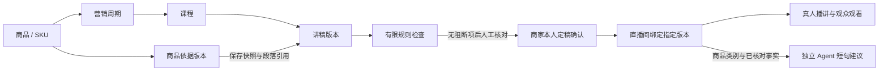

# 靠谱：播前内容生产与审改

0.5.0 提供以商品为起点的人工内容工作流：建立商品依据、安排课程、编写讲稿、逐段检查、商家确认定稿，再交给真人主播使用。内容服务保留版本与依据快照；直播服务负责观看、推流、互动和活动；Agent 服务承担独立的短句建议与提示词评测。

本文描述当前代码提供的功能。部署位置、上线状态和验收记录分别见部署文档与验收文档。

## 从商品到直播

| 对象         | 当前保存的内容                                       | 使用边界                                                   |
| ------------ | ---------------------------------------------------- | ---------------------------------------------------------- |
| 商品         | 名称、SKU、类别、最新资料版本                        | 同一商家内 SKU 唯一，可被多个营销周期复用                  |
| 商品依据版本 | 商品信息、事实文本、出处说明、人工核对状态           | 新版本追加保存；出处是文本记录，系统不自动证明原材料真实   |
| 营销周期     | 所属商品、周期名称、受众、总天数                     | 1–365 天，创建周期不会自动生成全部课程                     |
| 课程         | 第几天、标题、目标、预计时长、排期说明、主播姓名     | 预计时长默认为 45 分钟；字段填写不代表讲稿已足以支撑该时长 |
| 讲稿版本     | 段落、事实引用、商品版本快照、修改说明、规则检查结果 | 已保存正文不被后续编辑覆盖，修改另存新版本                 |
| 定稿确认     | 确认时间、当前商家身份、核对说明                     | 当前为商家本人自确认，未设置独立审稿人角色                 |
| 直播绑定     | 直播间、课程、指定讲稿版本、绑定时间                 | 一个直播间当前绑定一个版本；新建讲稿不会自动替换绑定       |

内容对象均通过商家身份查询和变更，所属商品、周期、课程与直播间需要属于同一商家。数据保存于业务数据库，与独立 Agent 数据库分开。

## 界面操作

1. 在“商品与课程”创建商品，填写 SKU 和商品类别，逐条录入事实与出处，按实际核对情况设置是否已核对。
2. 为商品创建营销周期，并逐课安排主题、目标、天数、预计时长和主播信息。主播姓名目前是排期文本，不会创建主播账号。
3. 在课程中逐段编写讲稿，或导入 UTF-8 文字文件。导入按空行分段，只进入编辑区，仍需设置段落类型、关联依据并保存。
4. 将商品主张标为“商品事实”并关联当前版本的已核对依据；流程衔接、提问与互动可标为过渡段。段落类型不能用来豁免商品主张的证据要求。
5. 点击“保存新版本并检查”，查看逐段的阻断项和复核提示。修改后再次保存新版本。未保存的文字不能确认定稿或绑定。
6. 完成人工核对，填写核对与审改记录并勾选确认，记录商家本人定稿确认。服务端拒绝仍有阻断项或商品依据已变化的版本。
7. 选择直播间绑定定稿，在直播控制台使用“本场定稿”逐段播讲。支持前后翻段、目录跳转、字号调整、专注播讲及当前段引用查看。绑定不会自动开播。

讲稿文件目前按 UTF-8 文本读取，不支持 Word、PDF、音视频内容解析，也没有讲稿导出功能。单课上限为 40 段、12,000 字符，每段最多 1,500 字符；每段最多引用 8 条事实。商品版本最多 40 条事实，每条事实 400 字符、出处 500 字符。字符限制按 JavaScript 字符串长度计算，内容接口另有 128 KiB 请求上限。

## 检查结果如何使用

检查在业务服务本地运行，不依赖外部模型。规则版本、检查时间、段落编号和问题类型随讲稿保存。当前主要检查：

- 事实段缺少引用，或引用不存在、未核对、缺少出处的事实。
- 未关联依据的过渡段含商品参数、适用性或效果信息。
- 有限数值与单位是否能在所引用事实中找到。
- 有限排名、优越性、治疗与保证效果表达，以及要求绕过审查的指令。
- 情感联想、亲历表达和普遍感受承诺的人工复核需求。

检查分为 `block` 和 `review`。`block` 会阻止定稿与绑定；`review` 要求商家阅读并人工判断。关联了事实的段落仍会留下人工复核提示，因为匹配引用或数值不能证明整段语义均获支持。

“没有阻断项”仅表示未命中当前有限规则，不是完整语义审查、法律结论或独立审稿人批准。当前规则没有检索法规、核验检测报告、判断证书有效期或按品类资质自动放行的能力。商品类别已进入讲稿快照与检查上下文，但尚未构成完整的品类审核规则库。

## 版本与过期处理

商品资料更新使用 `baseVersion`，讲稿保存同时校验最新讲稿版本与当前商品版本。服务端在事务中检查版本；并行编辑发生冲突时返回 409，要求刷新，避免静默覆盖。

每篇讲稿保存当时的商品依据快照。商品新增任何资料版本后，引用旧商品版本的稿件变为 `needs_review`，历史确认仍保留用于追溯，但不能凭旧确认再次绑定。重新核对当前资料、保存新稿、确认并绑定后恢复使用。

直播绑定固定到具体讲稿版本，保留历史关系。查询发现资料已变化时返回 `stale: true`。控制台在下一次读取绑定时暂停展示该稿，提示重新核对；当前每 5 秒检查一次。此处理不会停止媒体推流，真人主播仍需管理现场播讲。

## 与 Agent、资料导入和评测的接口

内容工作流可以在没有模型配置、没有 Agent 服务运行时独立完成。现有 Agent 接口支持本地事实规则和可配置的 OpenAI 兼容模型服务，但即使配置模型，当前输出仍受限于“选取并排列已审核事实与固定过渡片段”。它不会生成整课长稿，也不会自动审改正文。

绑定有效课程后，业务服务向 Agent 提供绑定快照中的商品名、类别和已核对事实；事实标识包含商品与资料版本，避免重绑后把旧引用误认成新依据。绑定已过期时不再提供这些事实。Agent 结果继续显示是否来自远程模型、是否发生规则回退及是否需要人工复核。

未绑定内容的旧直播间仍可使用原有房间事实。原“资料与评测”中的 CSV/JSON 导入记录仍属于直播间，尚未自动迁移到独立商品库。商品库当前使用商品编辑表单；两个入口不能视为已经统一的跨课程知识库。

品牌样例、提示词版本和短题评测继续属于独立 Agent 工作流。当前类别、事实或商品变更后，评测报告会标为历史结果。发布提示词、短题检查通过、人工风格评分和讲稿定稿是四种不同操作，前三者不会批准或绑定课程讲稿。

## 内容接口

以下路径均位于 `/api/merchant/content` 下，需要商家会话。

| 方法       | 路径                                    | 行为                                           |
| ---------- | --------------------------------------- | ---------------------------------------------- |
| GET / POST | `/products`                             | 列出 / 创建商品                                |
| GET        | `/products/:id`                         | 读取商品与历史资料版本                         |
| POST       | `/products/:id/versions`                | 基于 `baseVersion` 新增商品资料版本            |
| GET / POST | `/plans`                                | 列出 / 创建营销周期；GET 可用 `productId` 筛选 |
| GET        | `/plans/:id`                            | 读取周期与课程列表                             |
| POST       | `/plans/:id/courses`                    | 创建课程                                       |
| GET        | `/courses/:id`                          | 读取课程、商品和讲稿历史版本                   |
| POST       | `/courses/:id/scripts`                  | 保存新稿并运行有限规则检查                     |
| POST       | `/courses/:id/scripts/:version/confirm` | 保存商家本人定稿确认                           |
| GET / POST | `/rooms/:id/binding`                    | 读取 / 替换直播间当前讲稿绑定                  |

接口类型见 [`src/shared/content.ts`](../src/shared/content.ts)，实现见 [`src/server/content.ts`](../src/server/content.ts)。

## 尚未实现的范围

| 方向              | 当前边界                                  | 后续需要的能力                                                         |
| ----------------- | ----------------------------------------- | ---------------------------------------------------------------------- |
| AI 长稿生产与审改 | 正文由人编写或导入，现有 Agent 只输出短句 | 独立长稿任务、提纲与段落生成、受约束引用、审改意见、失败恢复与内容评测 |
| 多角色审批        | 商家本人确认，主播为文本字段              | 编辑 / 审稿 / 主播账号、权限分工、退回与审批队列、确认撤回及更完整审计 |
| 课程自动编排      | 手工建立周期和课程，填写预计时长          | 跨课去重、时长估算、系列节奏校验、排班冲突与课程维护                   |
| 资料管理          | 结构化事实与出处文字、版本快照            | 原始文件保存、解析、证据有效期、商品资料批量导入和统一迁移             |
| 线下转化归因      | 直播观看、提问和演示红包等基础分析        | 门店 / 场次对象、渠道与预约、到店核销、订单及归因口径                  |
| 微信与真实支付    | 网页观看、匿名演示身份及演示红包          | 获授权的微信身份、支付适配、验签对账及外部渠道联调；见支付文档         |

现有预计时长、周期天数、主播字段和基础观看分析不代表已经完成这些业务能力。真实商家资料、授权样例和业务文件应保存在各自部署及业务资料存储中，不作为公开源码的演示素材。

## 建议的验收路径

1. 建立商品、周期和课程，录入事实段与过渡段，保存后重新打开，核对正文、引用和版本快照。
2. 用缺少依据、引用未核对事实或数值不受支持的段落保存，确认出现逐段阻断且不能定稿；修正后另存新版本。
3. 填写人工核对记录并确认，绑定直播间，核对逐段播讲、字号、目录和引用；确认观众页没有商家讲稿或证据内容。
4. 更新商品事实或类别，确认旧稿与绑定进入待复核，Agent 不再使用旧事实；重新定稿绑定后再核对恢复结果。
5. 在两个会话同时编辑同一商品或课程，确认旧基准提交返回 409；切换课程或房间时不出现上一对象的稿件、绑定或异步结果。
6. 保持模型未配置，完成手工内容流程；再测试 Agent 断开或模型失败时的明确状态，避免把规则回退当成长稿生成成功。

这些是功能验收场景，不表示已完成真实业务、媒体传输或外部渠道验收。整体检查方式见项目 README。
